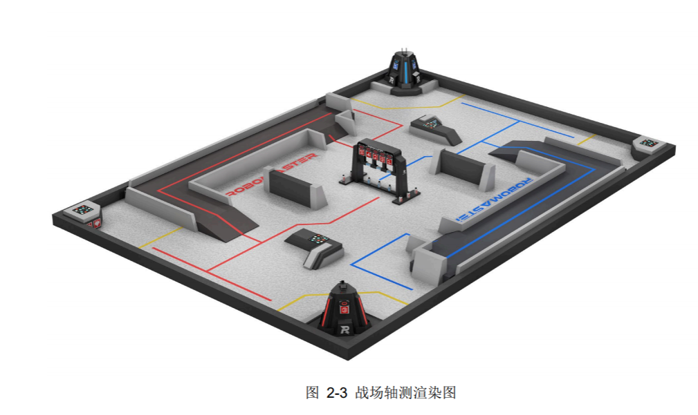
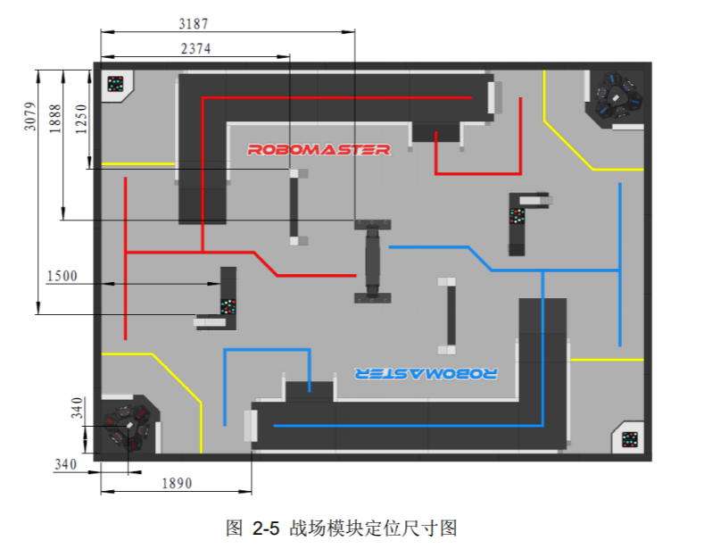

# ROBOND-P1-Build My World

Udacity Robotics Software Engineer Nanodegree - Project 1 - Build My World
 
### Table of Contents

1. [Project Overview](#ProjectOverview)
2. [File Description](#FileDescription)
3. [Instructions](#Instructions)

## 1. Project Overview <a name="ProjectOverview"></a>
Goal of the project is design a Gazebo World environment by including multiple models and use it as base for all the upcoming projects. Inspired by this [robot competition](https://www.robomaster.com/zh-CN/robo/youth/overview), I designed a robot battleground scenario.Below is the prototype of the robot battleground model

<table>
	<tr>
    	<td></td>
    	<td></td>
	</tr>
</table>

## 2. Files  <a name="FileDescription"></a>
<pre>
p1_Build My World                   // Build My World Project 
    │  CMakeLists.txt               // Link libraries 
    │  README.md
    │
    ├─imgs
    │      rm_battleground.1.png
    │      rm_battleground.2.png
    │
    ├─model
    │  ├─Building
    │  │      model.config
    │  │      model.sdf
    │  │
    │  └─my_robot
    │          model.config
    │          model.sdf
    │
    ├─script                        // Gazebo World plugin C++ script
    │      hello.cpp
    │
    └─world                         // Gazebo main World containing models 
            robo_battleground

</pre>

## 3. Instructions <a name="Instructions"></a>
```python
1. Create a build directory and compile the code

$ cd /home/workspace/myrobot
$ mkdir build
$ cd build/
$ cmake ../
$ make # You might get errors if your system is not up to date!
$ export GAZEBO_PLUGIN_PATH=${GAZEBO_PLUGIN_PATH}:/home/workspace/myrobot/build
```